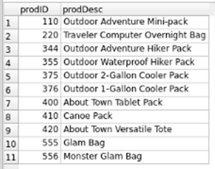

# 🕵️ Retail Forensics – The Jaxpax Case Files

Each query is framed as a **forensic case** to investigate different aspects of the retail business dataset.  
Findings are documented alongside outputs for clarity.

---

## Case 1 — Supplier Link Analysis
Query to trace the supplier of Canoe Pack fabric via Product as the linking table.  
**Forensic Finding:** Supplier email successfully identified through indirect joins.  
**Output:**  

---

## Case 2 — Pricing Structure Audit
Query calculating average, total, min, and max product prices across catalog.  
**Forensic Finding:** Catalog spans from lowest to highest price, with overall average ~56.32 across all products.  
**Output:**  

---

## Case 3 — Order Behavior Profiling
Query grouping orders to calculate average product price and total items per order.  
**Forensic Finding:** Each order profiled, distinguishing between small vs. bulk customer behavior.  
**Output:**  

---

## Case 4 — Shipping Efficiency Review
Query joining Orders and Shipper to find busiest logistics provider.  
**Forensic Finding:** United States Postale identified as busiest shipper, handling 6 orders.  
**Output:**  

---

## Case 5 — High-Volume Orders Detection
Query using HAVING to flag orders with more than 2 products.  
**Forensic Finding:** High-value bulk orders identified, showing customer segments with larger demand.  
**Output:**  

---

## Case 6 — Regional Supplier Trace
Query tracing multi-product orders back to Minnesota-based suppliers.  
**Forensic Finding:** Orders linked to MN suppliers, confirming regional sourcing dependencies.  
**Output:**  

---

## Case 7 — Product Pricing Outliers
Query comparing product prices against overall average using subquery.  
**Forensic Finding:** Premium/high-margin products above average price identified.  
**Output:**  

---

## Case 8 — Discount Impact Analysis
Query calculating order totals before and after applying discount levels (5%, 10%, 20%).  
**Forensic Finding:** Revenue impact of promotions quantified, showing exact reduction in totals after discount.  
**Output:**  

---
## Case 9 — Division Coverage Review
Query using UNION to combine products from East and West divisions.  
**Forensic Finding:** 13 total records reduced to 11 unique products after duplicates removed.  
**Output:**  

---

## Case 10 — Division Overlap Check
Query using INTERSECT to identify products manufactured in both divisions.  
**Forensic Finding:** 2 products found as overlap, showing shared production between East and West.  
**Output:**  

---
